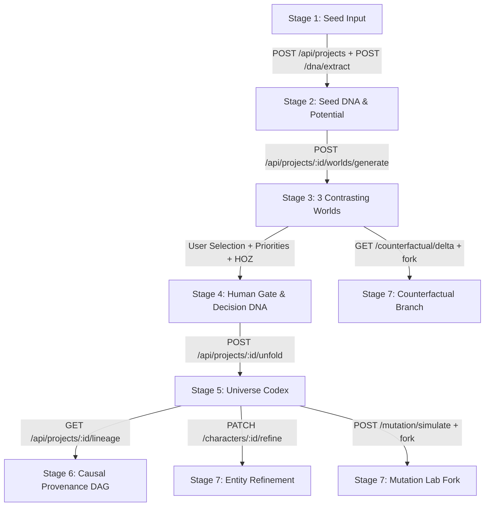

# 30-04-DATA-FLOW.md: End-to-End Data Flow & Downstream Propagation Architecture

**Audit Date:** 2026-10-08  
**Scope:** PRAROHA (Seed Unfold) — Full Pipeline Data Flow from Seed Input to Refinement & Branching  
**Methodology:** Full AST trace, live HTTP execution monitoring, database row insertion verification, and state transition analysis across all 7 stages.

---

## 1. Pipeline Lifecycle Overview



---

## 2. Stage-by-Stage Detailed Data Flow Trace

### Stage 1: Seed Input (`SeedInputCanvas.tsx`)
1. **User Action:** User types a creative prompt or clicks one of 3 presets (e.g., "Sunken Ocean City", "Silent Orbital Ark", "The Whispering Forest") and clicks **"Extract Seed DNA"**.
2. **Frontend State:**
   - `workspaceStore.seedText` is set.
   - `isExtracting` is set to `true`, `extractionStep` set to `"Distilling core semantic premise & themes..."`.
3. **Network Call 1:**
   - `POST /api/projects`
   - Body: `{"title": "Creative Seed...", "seed_text": "..."}`
   - DB: Inserts row into `projects` table (`id`, `title`, `seed_text`, `status: 'draft'`, `branch_name: 'main'`).
   - Response: `ProjectRead` object with new `project.id`.
4. **Network Call 2:**
   - `POST /api/projects/{project_id}/dna/extract`
   - Body: `{"raw_seed": "..."}`
   - Backend Processing: `GeminiProvider.extract_dna()`.
   - **Audited Vulnerability:** In current deployment, `gemini-3.5-flash` fails with `HTTP 429/404/Timeout`. Execution cascades to `MockProvider.extract_dna()`, returning `CANONICAL_SEED_DNA` regardless of what user entered.
   - DB: Inserts row into `seed_dna` table (`id`, `project_id`, `raw_seed`, `premise`, `themes_json`, `entities_json`, `constraints_json`, `tone`, `domain_keywords_json`). Updates `projects.status = 'seed_extracted'`.
5. **Frontend State Hydration:**
   - `workspaceStore.activeProject = res.project`
   - `workspaceStore.seedDNA = res.seed_dna`
   - `workspaceStore.unlockedStages = ['seed', 'understand']`
   - `workspaceStore.activeStage = 'understand'`
   - Persisted to browser `localStorage` under key `seed-unfold-workspace`.

---

### Stage 2: Understand (`SeedPotentialCanvas.tsx` & `SeedDnaViewer.tsx`)
1. **User Action:** The user reviews the extracted premise, themes, and entities. On the Potential Canvas, the user reviews 8–12 possibility items (categorized as `explicit`, `inferred`, or `open`) and toggles them as **Accepted** (Pillar) or **Rejected** (Guardrail).
2. **Network Calls:**
   - On mount: `POST /api/projects/{id}/potential/extract` (extracts items) or `GET /api/projects/{id}/potential` (reads existing).
   - On individual toggle: `PATCH /api/projects/{id}/potential/{item_id}` with `{"user_status": "accepted" | "rejected"}`.
   - On "Accept All": `POST /api/projects/{id}/potential/batch` with array of items.
   - DB: Updates `seed_potential_items.user_status` in Postgres.
3. **Downstream Propagation:**
   - Accepted items become mandatory **Creative Pillars** injected into Stage 3 world generation.
   - Rejected items become **Negative Guardrails** forbidding unwanted tropes.
   - Open items become **Catalytic Dilemmas** inspiring world tensions.

---

### Stage 3: 3 Worlds (`WorldCandidatesCanvas.tsx`)
1. **User Action:** User clicks **"Generate 3 Worlds"**.
2. **Frontend State:**
   - `isGeneratingWorlds = true`.
   - Client timers sequentially show: `"Analyzing Seed DNA constraints..."` -> `"Formulating contrasting archetypes..."` -> `"Synthesizing core tensions..."`.
3. **Network Call:**
   - `POST /api/projects/{project_id}/worlds/generate`
   - Backend Processing:
     - `repo.get_latest_seed_dna(project_id)` fetches DNA.
     - `repo.get_potential_items(project_id)` fetches accepted/rejected items.
     - `ai_provider.generate_worlds(dna_dict, potential_items)` is called.
     - System prompt instructs LLM to produce exactly three archetypes:
       - Candidate 1: `familiar` (Grounded realization, 85-95% seed fidelity)
       - Candidate 2: `radical` (Transformative leap, 85-98% novelty)
       - Candidate 3: `inverse` (Conceptual subversion, 80-95% conceptual distance)
     - DB: Inserts 3 rows into `world_candidates` table (`id`, `project_id`, `seed_dna_id`, `batch_id`, `candidate_index: 1, 2, 3`, `title`, `archetype`, `concept`, `aesthetic`, `core_tension`, `trade_offs`, `key_visual`, `divergence_archetype`, `exploration_profile_json`, `emphasized_potential_labels_json`). Updates `projects.status = 'worlds_generated'`.
4. **Frontend State Hydration:**
   - `workspaceStore.worlds = res.data` (array of 3 candidates).
   - `workspaceStore.unlockedStages` adds `'worlds'` and `'choose'`.
   - `workspaceStore.activeStage = 'worlds'`.

---

### Stage 4: Choose & Human Gate (`WorldSelectionCanvas.tsx`)
1. **User Action:** The creator selects one of the 3 candidates (e.g. Bio-City), enters their personal creative rationale, selects 2+ creative priorities, flags rejected directions, and optionally locks **Human-Only Zones (HOZ)** (Core Theme, Protagonist Motivation, Central Conflict).
2. **Network Call:**
   - `POST /api/projects/{project_id}/worlds/{candidate_id}/select`
   - Body:
     ```json
     {
       "user_rationale": "I want a deeply atmospheric, melancholic tone focusing on...",
       "creative_priorities": ["Ecological Symbiosis", "Melancholy"],
       "rejected_directions": ["Military Conflict", "Cyberpunk Tropes"],
       "human_only_zones": {
         "core_theme": "Coexistence requires sacrifice",
         "protagonist_motivation": "Protect the dying nursery",
         "central_conflict": "The surface pumps are poisoning the reef",
         "is_locked": true
       }
     }
     ```
   - DB: Inserts row into `world_selections` table. Sets `projects.selected_world_id = candidate_id` and `projects.status = 'world_selected'`.
3. **Downstream Propagation (The Decision DNA Contract):**
   - The selected world, author rationale, priorities, and HOZ are bundled into **Decision DNA**.
   - This bundle is strictly required by Stage 5 Unfold. The backend enforces that `projects.status == 'world_selected'` before allowing unfolding.

---

### Stage 5: Unfold & Universe Codex (`UniverseCodexCanvas.tsx`)
1. **User Action:** User clicks **"Unfold Universe"** (or auto-unfolds from Stage 4 commitment).
2. **Frontend State:**
   - `isUnfolding = true`.
   - Step timers increment `unfoldingStep` 1 -> 2 -> 3 -> 4.
3. **Network Call:**
   - `POST /api/projects/{project_id}/unfold`
   - Backend Processing:
     - Fetches Project, Seed DNA, Selected Candidate, Selection Contract, and HOZ.
     - Calls `ai_provider.unfold_universe(context)`.
     - Injects `=== DECISION DNA CREATIVE CONTRACT ===` into prompt.
     - Deterministic HOZ Guard (`enforce_human_only_zones_guard`): Even if LLM hallucinates, backend code overwrites `canon_facts[0]`, `characters[0].motivation`, and `scenes[climax].conflict` with the author's exact locked strings.
     - DB Transaction:
       - Inserts 1 `world_bibles` row (physics, geography, history, factions, canon facts, key locations).
       - Inserts 2–4 `characters` rows (name, role, archetype, motivation, conflict, visual prompt).
       - Inserts 1–6 `character_relationships` rows (source, target, relationship type, dynamic).
       - Inserts 2–3 `scenes` rows (title, setting, dramatic question, conflict, outcome, visual prompt).
       - Updates `projects.status = 'universe_unfolded'`.
4. **Frontend State Hydration:**
   - `workspaceStore.unfoldedUniverse = res.data`.
   - `unlockedStages` adds `'unfold'`, `'trace'`, `'refine'`.
   - `workspaceStore.activeStage = 'unfold'`.

---

### Stage 6: Trace & Causal Provenance DAG (`TraceabilityCanvas.tsx`)
1. **User Action:** Creator navigates to Stage 6 to audit how their initial seed evolved into lore, characters, and scenes.
2. **Network Call:**
   - `GET /api/projects/{project_id}/lineage`
   - Backend Processing (`LineageService.build_project_lineage`):
     - Dynamically queries Project, Seed DNA, World Candidates, Selection Record, World Bible, Characters, Relationships, Scenes, and Revisions from Postgres.
     - Synthesizes 15–20 `TraceNode` items across 6 hierarchical lanes:
       - Lane 1: `root_seed` (Stage 1)
       - Lane 2: `seed_dna` (Stage 2)
       - Lane 3: `world_candidate` & `human_selection` (Stages 3 & 4)
       - Lane 4: `world_bible` & `key_location` (Stage 5)
       - Lane 5: `character` & `relationship` (Stage 5)
       - Lane 6: `scene` (Stage 5)
     - Synthesizes `TraceEdge` items connecting causal parents to children (`derived_from`, `selected_by`, `appears_in`, `generated_for`).
   - Response: `TraceGraphRead` containing `{ nodes, edges }`.
3. **Frontend Rendering:**
   - Renders 6-lane interactive DAG canvas with solid borders, color-coded stage badges, and clickable nodes.
   - Clicking any node opens `WhyIsThisHereModal.tsx` showing exact plain-English causal explanation and ancestor trail.

---

### Stage 7: Refine, Branch, Mutate & Replay
Stage 7 splits into four specialized workflows:

#### 7A. In-Place Entity Refinement (`RefinementModal.tsx`)
- Creator refines character motivation or scene conflict.
- Calls `PATCH /api/projects/{id}/characters/{cid}/refine` or `/scenes/{sid}/refine`.
- Backend updates entity, increments `version`, and writes an immutable diff log to `entity_revisions` table.

#### 7B. Project Branching (`TopBar.tsx`)
- Calls `POST /api/projects/{id}/branch` with `branch_name` and `branch_point_stage`.
- Backend clones project row with `parent_project_id = parent.id` and duplicates entities up to the branch stage.

#### 7C. Seed Mutation Lab (`SeedMutationLabCanvas.tsx`)
- Calls `GET /api/projects/{id}/mutation/variables` to get 4 core variables.
- User alters variable (e.g., changes premise from "peaceful library" to "military outpost").
- Calls `POST /api/projects/{id}/mutation/simulate` -> returns classified impact list (`AFFECTED`, `CONDITIONAL`, `PRESERVED`).
- Calls `POST /api/projects/{id}/mutation/fork` -> clones project into dedicated `mutation/branch-name` timeline.

#### 7D. Counterfactual Replay (`CounterfactualReplayCanvas.tsx`)
- Calls `GET /api/projects/{id}/counterfactual/candidates` (retrieves the 2 worlds NOT chosen in Stage 4).
- Calls `GET /api/projects/{id}/counterfactual/delta/{candidate_id}` -> computes divergence score (0–100) and delta comparison.
- Calls `POST /api/projects/{id}/counterfactual/fork` -> forks timeline into an alternate reality where the other world was chosen.
