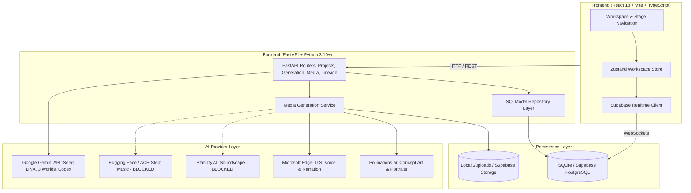

# PRAROHA
### Seed → Universe
### Tatva 2 — Forms Hidden in Formless

**Vedanta Makeathon Project**  
**Team Name:** Supreme  
**Institution:** SJCIT, Chikkaballapura  
**Team Members:** Sandhya C, Syed Imadulla, Thriveni S A, Teja J  
**Project Status:** Completed hackathon project; documentation consolidated post-Vedanta Makeathon.

---

## 1. Introduction

What if one small idea could become an entire universe?

That is the idea behind PRAROHA. Inspired by Tatva 2 — Seed to Universe, PRAROHA helps uncover the hidden potential inside an idea and develop it into a fictional world that people can explore, edit, and build stories around.

---

## 2. What is PRAROHA?

PRAROHA is an AI-powered creative worldbuilding platform. A user starts with a simple idea, explores three possible worlds, selects one, and develops it into a connected universe containing world details, characters, relationships, story beats, and scenes. The platform can also generate concept images and character voices or narration using available AI services.

The creator can inspect how generated elements connect to the original idea, continue refining the universe, and export the project.

---

## 3. What Problem Does It Solve?

Generative AI can produce text, images, and audio, but creating a consistent fictional world across multiple tools often requires repeated prompting and manual effort.

Characters may become inconsistent, story details may contradict each other, and the connection between the original idea and later outputs can be lost.

PRAROHA brings these creative elements into one connected workspace while preserving the original idea, the creator's choices, and the relationships between generated elements.

---

## 4. Who Can Use It?

- **Writers:** Develop story ideas, characters, settings, and plotlines.
- **Game developers:** Explore fictional worlds, characters, and narrative concepts.
- **Filmmakers:** Develop story concepts and visualise scenes.
- **Content creators:** Turn initial ideas into connected creative content.
- **Creative students and hobbyists:** Explore different directions for an idea and develop the one they prefer.

---

## 5. Philosophical Foundation: Tatva 2

PRAROHA is grounded in a single guiding philosophy: **Tatva 2 — Seed to Universe: Forms Hidden in Formless**.

> *"The seed is the idea. The universe is what it can become."*

A small seed holds the potential to become something much larger. In the same way, a simple idea contains possibilities that are not immediately visible. PRAROHA helps uncover these possibilities and develop the original idea into a structured, explorable fictional universe.

- **Seed:** The user's initial idea or concept.
- **Hidden potential:** Themes, possibilities, settings, characters, conflicts, and creative directions contained within that idea.
- **Unfolding:** AI develops the idea into multiple possible worlds.
- **Human choice:** The user selects the direction they want to pursue.
- **Visible universe:** The selected direction becomes a connected world with characters, relationships, story scenes, images, and voice narration where available.

The seven technical workflow stages in the application are practical implementation steps that demonstrate this single philosophy. They are not separate Tatvas.

---

## 6. How It Works: The Product Workflow

The PRAROHA workflow guides a creator from an initial prompt to an unfolded, explorable world:

1. **Enter an idea:** The creator enters an initial narrative seed (e.g., a premise, question, or scenario).
2. **Understand the seed:** Google Gemini analyses the seed, extracting structured Seed DNA (core motifs, themes, tone, constraints, and latent vectors).
3. **Explore three worlds:** The engine generates three divergent, high-contrast world candidates along orthogonal creative axes.
4. **Choose a world:** The creator selects one world direction and commits to it, capturing their creative rationale into Decision DNA.
5. **Develop the universe:** The platform progressively unfolds the selected world into a comprehensive Universe Codex:
   - **World Bible:** Physical laws, history, cultural factions, and key locations.
   - **Characters:** Profiles, motivations, personal conflicts, and archetypes.
   - **Relationships:** A dynamic socio-emotional web defining conflicts and alliances.
   - **Story Beats & Scenes:** Structured dramatic beats and scene settings.
6. **Bring elements to life:** Available AI providers generate real concept art for scenes and locations (via Pollinations.ai) and synthesized character voices and scene narration (via Edge-TTS).
7. **Explore connections:** The creator inspects the interactive Origin Trail (a Directed Acyclic Graph) to see the causal lineage connecting every rule, character, and scene back to the original seed.
8. **Save, refine, and export:** The creator can experiment in the Mutation Lab, replay counterfactual timelines, snapshot project state, and export a portable `.seedunfold.json` project bundle.

---

## 7. Main Features

- **Seed DNA Extraction:** Identifies latent motifs, conflicts, and constraints from arbitrary prompts.
- **Three-World Divergence Engine:** Produces three meaningfully distinct candidate worlds (e.g., grounded, radical, and inverse explorations).
- **Human Choice Gate:** Enforces creator commitment before unfolding; downstream generation is locked until a choice is confirmed.
- **Universe Codex (5 Layers):** Interconnected World Bible, Cast Profiles, Relational Dynamics, Story Beats, and Detailed Scenes.
- **Concept Art Generation:** Server-side integration with Pollinations.ai for location concept art and character portraits with JPEG validation.
- **Neural Voice & Narration:** Online speech synthesis via Edge-TTS supporting curated persona voices and HTML5 playback.
- **Origin Trail Lineage DAG:** Visual directed acyclic graph mapping every entity's provenance (`SEED_EXPLICIT`, `SEED_INFERRED`, `HUMAN_DECISION`, `DERIVED`, `AI_INTRODUCED`).
- **Causal Provenance Inspector:** Explains why any character, law, or beat exists in plain language without exposing internal model chain-of-thought.
- **Seed Mutation Lab:** Allows testing premise modifications to preview downstream impacts (Affected, Conditional, Preserved).
- **Counterfactual Replay:** Compares the selected world against rejected candidates along key creative dimensions.
- **Human-Only Zones:** Creator-locked creative guardrails that prevent AI drift across core themes, protagonist motivations, and central conflicts.
- **Supabase Realtime Sync:** Two browser tabs or devices stay synchronized without manual page refresh.
- **Project Isolation & Ownership:** Enforced server-side project authorization and data isolation.
- **Portable Bundle Export:** Export and re-import complete fictional worlds as structured JSON (`.seedunfold.json`).

---

## 8. Example Walkthrough

**Starting idea:**  
> *"A village where nobody can lie."*

1. **Seed Understanding:** Gemini extracts the latent themes: involuntary truth, societal vulnerability, trust economics, and emotional friction.
2. **Three Worlds Generated:**
   - *World A (Botanical Truth):* A pollen from a sacred valley physically chokes anyone attempting falsehood.
   - *World B (Cognitive Mirror):* Thoughts are projected visually above citizens' heads as bioluminescent halos.
   - *World C (Architectural Vow):* An ancient stone bell tower tolls violently whenever deceit is uttered within its perimeter.
3. **Human Choice:** The creator selects *World B (Cognitive Mirror)*.
4. **Universe Unfolding:** The platform generates the village name, social hierarchy, characters (e.g., an archivist who wears a mirrored veil), their strained relationships, and an opening scene where someone learns to think in riddles.
5. **Media Generation:** Concept art visualizes the misty valley with glowing head-halos; narration audio reads the archivist's opening monologue.
6. **Final Result:** An editable, persistent, and exportable fictional universe developed from one simple sentence.

---

## 9. Technology Stack

| Layer | Technologies |
| :--- | :--- |
| **Frontend** | React 18, Vite, TypeScript, Tailwind CSS, Zustand, Framer Motion, Lucide Icons |
| **Backend** | Python 3.10+, FastAPI, SQLModel (SQLAlchemy 2 core), Pydantic v2 |
| **Database & Persistence** | SQLite with aiosqlite (local) / Supabase PostgreSQL (cloud), Supabase Storage / local `./uploads` |
| **Realtime** | Supabase Realtime broadcast layer (`projects:<id>` channels) |
| **Text Generation** | Google Gemini (`gemini-3.1-flash-lite`, `gemini-flash-latest`) |
| **Image Generation** | Pollinations.ai (Flux / Sana models with Bearer auth) |
| **Speech & Narration** | Edge-TTS (online neural speech service) |
| **Soundscape (Code Integrated)** | Stability AI Stable Audio 2 (`/v2beta/audio/stable-audio-2/text-to-audio`) |
| **Music (Code Integrated)** | Hugging Face Inference (`facebook/musicgen-small`) / ACE-Step |

---

## 10. System Architecture



---

## 11. Installation and Developer Setup

### Prerequisites
- **Node.js:** 18.x or later
- **Python:** 3.10 or later
- **Git**

### 1. Clone Repository & Setup Virtual Environment
```bash
git clone https://github.com/syed-imadulla/Praroha.git
cd Praroha

# Create and activate Python virtual environment
python3 -m venv venv
source venv/bin/activate

# Install backend dependencies
pip install -r backend/requirements.txt

# Install frontend dependencies
npm --prefix frontend install
```

### 2. Configure Environment Variables
Copy `.env.example` to `backend/.env` (or configure in root):
```bash
cp .env.example backend/.env
```
Key configuration items:
- `AI_PROVIDER=gemini` (enables live Gemini text generation; set to `mock` for deterministic offline fixtures).
- `GEMINI_API_KEY=your_gemini_api_key_here` (from Google AI Studio).
- `POLLINATIONS_API_KEY=your_pollinations_key_here` (optional; unauthenticated requests fall back to supported public models).
- `STORAGE_PROVIDER=local` (or `supabase` when cloud credentials are provided).

### 3. Run the Backend API (Port 8000)
```bash
uvicorn backend.app.main:app --port 8000 --host 0.0.0.0 --reload
```
API Documentation will be live at `http://localhost:8000/docs`.

### 4. Run the Frontend Development Server (Port 5174)
```bash
npm --prefix frontend run dev
```
Open `http://localhost:5174` in your browser.

---

## 12. AI Provider Status & Capabilities

PRAROHA maintains strict transparency regarding third-party AI provider availability:

| Provider | Purpose | Status | Live Result | Output & Persistence |
| :--- | :--- | :--- | :--- | :--- |
| **Google Gemini** | Seed DNA, 3 Worlds, Codex unfolding | **VERIFIED LIVE** | Live response in ~1.9s | Structured JSON validated against Pydantic schema, saved to database |
| **Pollinations.ai** | Location concept art, character portraits | **VERIFIED LIVE** | Generated in ~450ms | Valid 1024×1024 JPEG binary payload saved to storage |
| **Edge-TTS** | Character voices, scene narration | **VERIFIED LIVE** | Generated in ~960ms | Valid MP3 audio saved to storage, attached to entity, playable via HTML5 |
| **Stability AI Stable Audio** | Atmospheric soundscape generation | **BLOCKED** | HTTP 401/402 | Implementation updated to Stable Audio 2 synchronous protocol; requires funded API key |
| **Hugging Face / ACE-Step** | Atmospheric music generation | **BLOCKED** | HTTP 404/410 | Implemented in code; blocked because serverless inference is not supported for MusicGen without a dedicated endpoint |

*Note: In Real Mode, when an audio provider is blocked, PRAROHA displays a clear error state and retry action. It never generates fabricated mock media in place of real assets.*

---

## 13. Testing and Verification

The PRAROHA codebase has undergone end-to-end regression testing:

- **Backend Test Suite:** 182 passed, 1 skipped (`pytest backend/tests`).
- **Frontend Production Build:** Built cleanly in 13.2s with zero TypeScript errors (`npm run build`).
- **Live Provider Smoke Test:** Verified Gemini, Pollinations, and Edge-TTS live execution via `PYTHONPATH=. python3 backend/tests/smoke_test_providers.py`.
- **Eight-Stage Journey E2E:** Automated browser test ([test_phase31_10_journey.mjs](file:///home/syed-imadulla/Desktop/Praroha/frontend/e2e/test_phase31_10_journey.mjs)) completed end-to-end with arbitrary seeds.
- **Multi-Tab Realtime Synchronization:** Verified multi-tab state sync and project isolation via [test_phase31_10_realtime.mjs](file:///home/syed-imadulla/Desktop/Praroha/frontend/e2e/test_phase31_10_realtime.mjs).

To run backend tests:
```bash
pytest backend/tests
```

To run provider smoke verification:
```bash
PYTHONPATH=. python3 backend/tests/smoke_test_providers.py
```

---

## 14. Project Structure

```
Praroha/
├── backend/
│   ├── app/
│   │   ├── api/            # FastAPI endpoints (projects, worlds, unfold, media, lineage)
│   │   ├── models/         # SQLModel database and domain schemas
│   │   ├── providers/      # AIProvider implementations (Gemini, Pollinations, Edge-TTS, Stability)
│   │   ├── repositories/   # Database access layer
│   │   ├── services/       # Domain logic: UniverseService, MediaService, LineageService
│   │   ├── config.py       # Pydantic BaseSettings configuration
│   │   └── main.py         # FastAPI application entrypoint
│   └── tests/              # Pytest test suite (182+ tests)
├── frontend/
│   ├── src/
│   │   ├── components/     # Canvas components for Stages 1–7, modals, cards
│   │   ├── store/          # Zustand workspace store
│   │   ├── realtime/       # Supabase Realtime channel subscriptions
│   │   ├── types/          # TypeScript domain interfaces
│   │   ├── App.tsx         # Root workspace routing and application shell
│   │   └── main.tsx        # React entrypoint
│   ├── e2e/                # Playwright end-to-end test scenarios
│   └── vite.config.ts      # Vite configuration (Port 5174, API proxy)
├── docs/                   # Consolidated project documentation
│   ├── PROJECT_OVERVIEW.md # Comprehensive narrative and concept guide
│   ├── ARCHITECTURE.md     # In-depth technical architecture
│   ├── AI_PROVIDERS.md     # Detailed AI provider specification
│   ├── SETUP.md            # Developer setup and run guide
│   └── TESTING.md          # Test ledger and verification results
├── startDocs/              # Original product blueprints and PDFs
└── README.md               # Primary project documentation entrypoint
```

---

## 15. Known Limitations

- **Atmospheric Audio Generation:** While the synchronous Stable Audio 2 API protocol and Hugging Face client are implemented and covered by unit tests, live generation requires external funded credits and dedicated inference endpoints.
- **Offline Dependency for Speech:** Edge-TTS relies on an online Microsoft service; it is not an offline embedded model.
- **Rate Limits:** Gemini generation is subject to standard Google Cloud API quota and rate limits.
- **Single-User Project Editing:** While multiple tabs update in real time for a project owner, collaborative multi-user live cursors are outside the current project scope.

---

## 16. Team Members

**Team Supreme (SJCIT, Chikkaballapura):**
1. **Sandhya C**
2. **Syed Imadulla**
3. **Thriveni S A**
4. **Teja J**

---

## 17. Hackathon Background & Acknowledgements

PRAROHA was conceived, architected, and built for the **Vedanta Makeathon**.

We express our gratitude to the organizers, mentors, and evaluators of the Vedanta Makeathon for the creative theme challenge that inspired this work:

> **Theme 2 (Tattva 2):** *Forms hidden in formless*  
> **Idea 1:** *Generative AI: “Seed → Tree / Word → Movie / Sound → Song”*

---

## 18. Documentation Index

For comprehensive documentation, see:
- [PROJECT_OVERVIEW.md](file:///home/syed-imadulla/Desktop/Praroha/docs/PROJECT_OVERVIEW.md) — Detailed narrative, philosophical connection, and user stories.
- [ARCHITECTURE.md](file:///home/syed-imadulla/Desktop/Praroha/docs/ARCHITECTURE.md) — System architecture, database schema, data flow, and security.
- [AI_PROVIDERS.md](file:///home/syed-imadulla/Desktop/Praroha/docs/AI_PROVIDERS.md) — Complete AI provider matrix, contracts, and limitations.
- [SETUP.md](file:///home/syed-imadulla/Desktop/Praroha/docs/SETUP.md) — Developer installation, configuration, and troubleshooting guide.
- [TESTING.md](file:///home/syed-imadulla/Desktop/Praroha/docs/TESTING.md) — Full test report, regression suites, and verification evidence.
