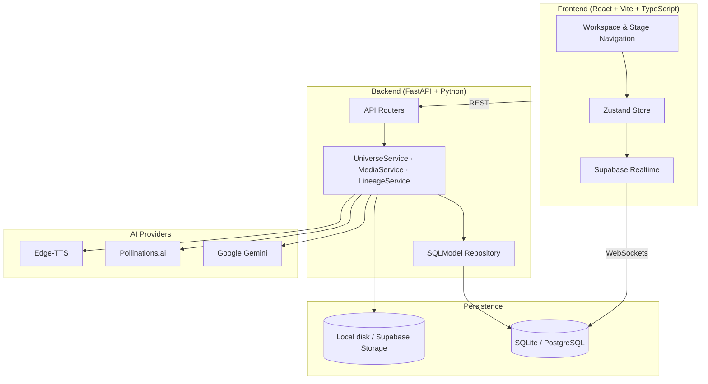

<div align="center">

<picture>
  <source media="(prefers-color-scheme: dark)" srcset="docs/assets/brand-dark.svg">
  <source media="(prefers-color-scheme: light)" srcset="docs/assets/brand-light.svg">
  
</picture>

*Tatva 2 — Forms Hidden in Formless*

An AI-powered creative worldbuilding platform built for the **Vedanta Makeathon** by **Team Supreme**.

</div>

## Introduction

What if one small idea could become an entire universe?

PRAROHA takes a single creative prompt and unfolds it into a structured fictional world — complete with lore, characters, relationships, story scenes, concept art, and voice narration. The creator stays in control throughout, choosing which direction the world develops and inspecting how every element traces back to the original idea.

The name comes from Sanskrit: *sprouting*, *germination* — the moment latent potential becomes visible form.

## The Problem

Generative AI can produce text, images, and audio, but building a *consistent* fictional world across these outputs requires repeated prompting, manual coordination, and careful continuity management. Characters drift, lore contradicts itself, and the connection between the original idea and later outputs gets lost.

PRAROHA solves this by treating world creation as a structured pipeline rather than an open-ended chat. Every generated element is anchored to the root idea through a database-backed provenance model.

## Philosophical Foundation: Tatva 2

> *"The seed is the idea. The universe is what it can become."*

PRAROHA is guided by a single philosophy: **Tatva 2 — Seed to Universe: Forms Hidden in Formless**. A simple idea contains hidden themes, possible settings, characters, conflicts, and story directions. PRAROHA unfolds that potential into alternative worlds, lets the creator choose a direction, and develops the selection into a connected universe.

The application's workflow stages are practical implementation steps demonstrating this philosophy. They are not separate Tatvas.

## How It Works

1. **Enter an idea** — A short narrative premise (a sentence, question, or scenario).
2. **Understand the seed** — Gemini extracts structured Seed DNA: core motifs, themes, tone, and constraints.
3. **Explore three worlds** — The engine generates three divergent world candidates along different creative axes.
4. **Choose a direction** — The creator commits to one world and records their rationale. Downstream generation is locked until this human choice is made.
5. **Develop the universe** — The selected world unfolds into a World Bible, Characters, Relationships, and Story Scenes.
6. **Bring elements to life** — Concept art (Pollinations.ai) and character voices (Edge-TTS) are generated for scenes and characters.
7. **Explore connections** — An interactive Origin Trail DAG shows how every rule, character, and scene traces back to the original seed.
8. **Refine and export** — Test premise mutations, replay counterfactuals, and export a portable `.seedunfold.json` bundle.

## Key Features

- **Seed DNA Extraction** — Structured identification of latent motifs, conflicts, and constraints.
- **Three-World Divergence** — Three meaningfully distinct candidate worlds from a single seed.
- **Human Choice Gate** — No autonomous runaway; the creator must commit before unfolding proceeds.
- **Universe Codex** — Interconnected World Bible, Cast Profiles, Relational Dynamics, and Story Scenes.
- **Concept Art** — Server-side Pollinations.ai integration producing validated JPEG images.
- **Voice & Narration** — Edge-TTS neural speech synthesis with curated character personas.
- **Origin Trail DAG** — Visual provenance graph mapping every entity back to the root seed.
- **Causal Inspector** — Plain-language explanations of why any element exists.
- **Mutation Lab** — Test how changing the premise affects downstream content.
- **Counterfactual Replay** — Compare the chosen world against rejected alternatives.
- **Realtime Sync** — Multi-tab synchronization via Supabase Realtime.
- **Portable Export** — Full project export/import as structured JSON.

## Example: "A village where nobody can lie"

**Seed DNA extracted:** Involuntary truth, societal vulnerability, trust economics, emotional friction.

**Three worlds generated:**
- *Botanical Truth* — Sacred pollen physically chokes anyone attempting falsehood.
- *Cognitive Mirror* — Thoughts project visually above citizens' heads as bioluminescent halos.
- *Architectural Vow* — An ancient bell tower tolls violently whenever deceit is spoken.

**Creator selects** *Cognitive Mirror*. The platform unfolds the village name, social hierarchy, characters (an archivist wearing a mirrored veil), strained relationships, and an opening scene. Concept art visualizes the misty valley; narration audio reads the archivist's monologue. Every element traces back to the original sentence.

## Technology Stack

| Layer | Technologies |
| :--- | :--- |
| **Frontend** | React 18, Vite, TypeScript, Tailwind CSS, Zustand, Framer Motion |
| **Backend** | Python 3.10+, FastAPI, SQLModel, Pydantic v2 |
| **Database** | SQLite / aiosqlite (local), Supabase PostgreSQL (cloud) |
| **Realtime** | Supabase Realtime broadcast channels |
| **Text Generation** | Google Gemini (`gemini-3.1-flash-lite`, `gemini-flash-latest`) |
| **Image Generation** | Pollinations.ai (Flux / Sana models) |
| **Speech** | Edge-TTS (online neural speech) |
| **Soundscape** | Stability AI Stable Audio 2 *(blocked — requires funded key)* |
| **Music** | Hugging Face MusicGen *(blocked — requires dedicated endpoint)* |

## Architecture



See [docs/ARCHITECTURE.md](docs/ARCHITECTURE.md) for the full data model, sequence diagrams, and security details.

## Quick Start

**Prerequisites:** Node.js 18+, Python 3.10+, Git.

```bash
# Clone and set up
git clone https://github.com/syed-imadulla/Praroha.git
cd Praroha

# Backend
python3 -m venv venv
source venv/bin/activate        # Windows: .\venv\Scripts\Activate.ps1
pip install -r backend/requirements.txt

# Frontend
cd frontend && npm install && cd ..

# Configure environment
cp .env.example backend/.env
# Edit backend/.env — set GEMINI_API_KEY for live generation,
# or leave AI_PROVIDER=mock for offline demo mode.

# Run (two terminals)
uvicorn backend.app.main:app --port 8000 --reload    # Backend
npm --prefix frontend run dev                          # Frontend → http://localhost:5174
```

## AI Provider Status

| Provider | Purpose | Status |
| :--- | :--- | :--- |
| **Google Gemini** | Text generation (Seed DNA, Worlds, Codex) | Previously verified live |
| **Pollinations.ai** | Concept art and character portraits | Previously verified live |
| **Edge-TTS** | Character voice and scene narration | Previously verified live (online service) |
| **Stability AI** | Atmospheric soundscapes | Blocked — requires funded API key |
| **Hugging Face / ACE-Step** | Background music | Blocked — requires dedicated inference endpoint |

When a provider is unavailable, PRAROHA displays a clear error state. Setting `AI_PROVIDER=mock` enables deterministic offline fixtures for demonstration.

See [docs/AI_PROVIDERS.md](docs/AI_PROVIDERS.md) for integration details and error handling.

## Testing

Historical regression results from the final hackathon audit:

| Suite | Command | Result |
| :--- | :--- | :--- |
| Backend tests | `pytest backend/tests` | 182 passed, 1 skipped |
| Frontend build | `npm --prefix frontend run build` | Clean (0 errors) |
| Provider smoke test | `PYTHONPATH=. python3 backend/tests/smoke_test_providers.py` | Gemini, Pollinations, Edge-TTS verified |
| E2E journey | `node frontend/e2e/test_phase31_10_journey.mjs` | All stages passed |
| Realtime sync | `node frontend/e2e/test_phase31_10_realtime.mjs` | Multi-tab sync verified |

See [docs/TESTING.md](docs/TESTING.md) for the full test ledger and instructions.

## Documentation

- [Project Overview](docs/PROJECT_OVERVIEW.md) — Purpose, philosophy, workflow, and a detailed example.
- [Architecture](docs/ARCHITECTURE.md) — System design, data model, request flow, and security.
- [AI Providers](docs/AI_PROVIDERS.md) — Provider contracts, authentication, and limitations.
- [Setup Guide](docs/SETUP.md) — Installation, configuration, and troubleshooting.
- [Testing Report](docs/TESTING.md) — Test strategy, results, and execution instructions.

## Team

**Team Supreme**

| Member | GitHub |
| :--- | :--- |
| Syed Imadulla | [https://github.com/syed-imadulla](https://github.com/syed-imadulla) |
| Sandhya C | [https://github.com/Sandhya2209-ui](https://github.com/Sandhya2209-ui) |
| Thriveni S A | [https://github.com/thriveni-sa](https://github.com/thriveni-sa) |
| Teja J | [https://github.com/TEJA-12345678](https://github.com/TEJA-12345678) |

## Hackathon

PRAROHA was built for the **Vedanta Makeathon**.

> **Theme 2 (Tattva 2):** *Forms hidden in formless*
> **Idea 1:** *Generative AI — Seed → Tree / Word → Movie / Sound → Song*
