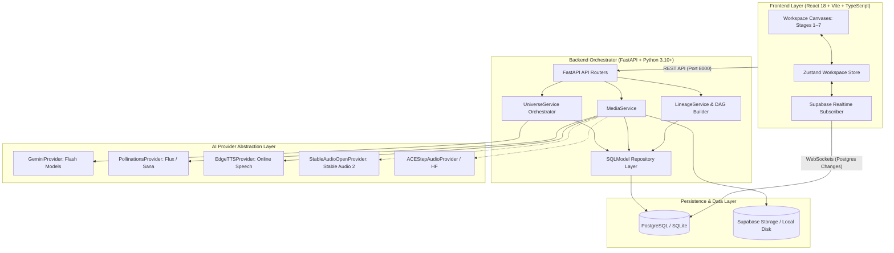
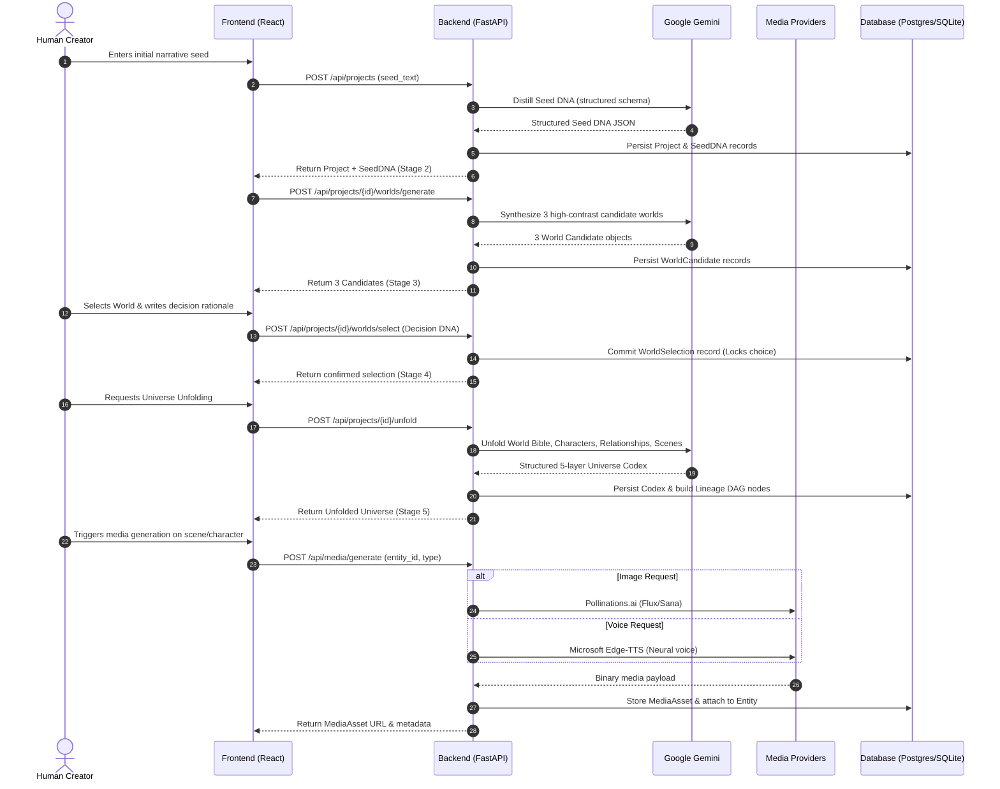
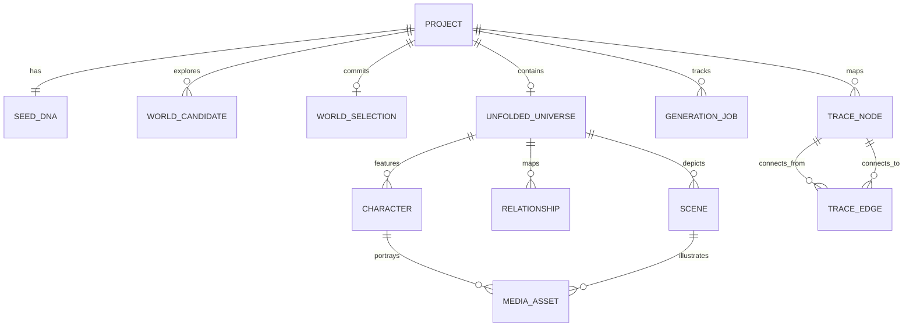

# PRAROHA — Technical Architecture

**Project:** PRAROHA  
**Core Concept:** Seed → Universe  
**Hackathon:** Vedanta Makeathon  
**Team:** Supreme  
**Status:** Completed Hackathon Technical Specification

---

## 1. System Overview

PRAROHA is designed as a modular, full-stack creative engine. It separates client-side state management, server-side orchestration, persistent relational storage, and third-party generative model providers behind strict abstraction boundaries.

---

## 2. Component Responsibilities

### Frontend Layer
- **Framework:** React 18 with Vite and TypeScript.
- **Styling & Design System:** Tailwind CSS following the botanical editorial aesthetic (Cream `#F8F4E8`, Forest Green `#294B3A`, Terracotta `#C38A66`, Cormorant Garamond headings, Inter body text).
- **State Management:** Zustand (`workspaceStore.ts`) providing reactive stage transitions, active entity selection, optimistic mutations, and localStorage rehydration.
- **Realtime Layer:** `frontend/src/realtime/projectSubscription.ts` establishes scoped channel subscriptions (`projects:<projectId>`) using `@supabase/supabase-js`, automatically reflecting server-side database mutations across concurrent browser tabs without manual page reloads.

### Backend Orchestration Layer
- **Framework:** FastAPI with Python 3.10+ async endpoints.
- **Domain Services:**
  - `UniverseService`: Coordinates the creative progression (Seed DNA extraction, 3-world synthesis, world selection commitment, and 5-layer universe unfolding).
  - `MediaService`: Manages asynchronous media generation jobs, rate-limit backoff, binary decoding, file storage, and entity attachment.
  - `LineageService`: Assembles and validates the Directed Acyclic Graph (DAG) of project entities, tracking ancestral origins and calculating causal diffs.
- **Data Access:** SQLModel / SQLAlchemy 2 async session management with schema validation using Pydantic v2.

---

## 3. Data Flow: From Seed to Universe

---

## 4. Database Entities and Data Model

The relational schema ensures complete referential integrity across all stages of creation:

### Core Schema Definitions
1. **Project (`projects`):** Root record storing title, creator `owner_id`, active stage, timestamps, and soft-delete graveyard state.
2. **SeedDNA (`seed_dna`):** Core motifs, thematic vectors, negative constraints, and aesthetic tone extracted from the seed.
3. **WorldCandidate (`world_candidates`):** Candidate title, high concept, aesthetic rules, and divergence axis metrics.
4. **WorldSelection (`world_selections`):** Selected world foreign key, human decision rationale, priorities, and rejected alternatives.
5. **UnfoldedUniverse (`unfolded_universes`):** JSON-backed World Bible (factions, canon laws, locations, magic/technology systems).
6. **Character (`characters`):** Name, archetype, motivation, flaw, backstory, and visual prompt descriptor.
7. **Relationship (`character_relationships`):** Source character, target character, relationship dynamic, and conflict narrative.
8. **Scene (`story_scenes`):** Sequence order, setting, dramatic conflict, and narrative beat.
9. **MediaAsset (`media_assets`):** Binary storage URL, asset type (image, voice, narration, atmosphere), provider name, MIME type, and entity foreign key.
10. **TraceNode & TraceEdge (`trace_nodes`, `trace_edges`):** Relational DAG representation storing node type, entity reference, origin tier, and parent connections.

---

## 5. Provenance & The Lineage DAG

PRAROHA models creative lineage using an explicit **Directed Acyclic Graph (DAG)**:

- **Node Types:** `SEED`, `SEED_DNA`, `WORLD_CANDIDATE`, `WORLD_SELECTION`, `WORLD_BIBLE_RULE`, `CHARACTER`, `RELATIONSHIP`, `SCENE`.
- **Origin Classifications:**
  - `SEED_EXPLICIT`: Directly mentioned in the user's initial prompt.
  - `SEED_INFERRED`: Logically deduced by Gemini during DNA analysis.
  - `HUMAN_DECISION`: Injected explicitly by the creator during world selection or Human-Only Zone definition.
  - `DERIVED`: Synthesized during progressive unfolding to support other entities.
  - `AI_INTRODUCED`: Creative embellishment introduced during scene or character generation.

The lineage engine guarantees topological consistency, allowing the **Causal Inspector** to traverse ancestor paths without circular dependencies.

---

## 6. Security, Ownership, and Secrets Management

1. **Server-Side API Key Storage:** All third-party AI keys (`GEMINI_API_KEY`, `POLLINATIONS_API_KEY`, `STABILITY_API_KEY`, `HF_TOKEN`) reside strictly in server-side environment variables. No external provider keys are bundled into the client-side JavaScript bundle or exposed via client-facing HTTP headers.
2. **Project Ownership Guards:** Every authenticated request verifies the caller's Supabase JWT. Projects are bound to `owner_id`. Backend endpoints reject unauthorized access with HTTP 404/403.
3. **Data Sanitization:** Input seeds are sanitized, and LLM outputs are validated against strict Pydantic models before being written to persistent storage.
4. **Resilient Failure Handling:** In Real Mode, if a third-party provider fails or lacks credits, the system registers a clean error badge and preserves a retry action. It never simulates fake outputs.
