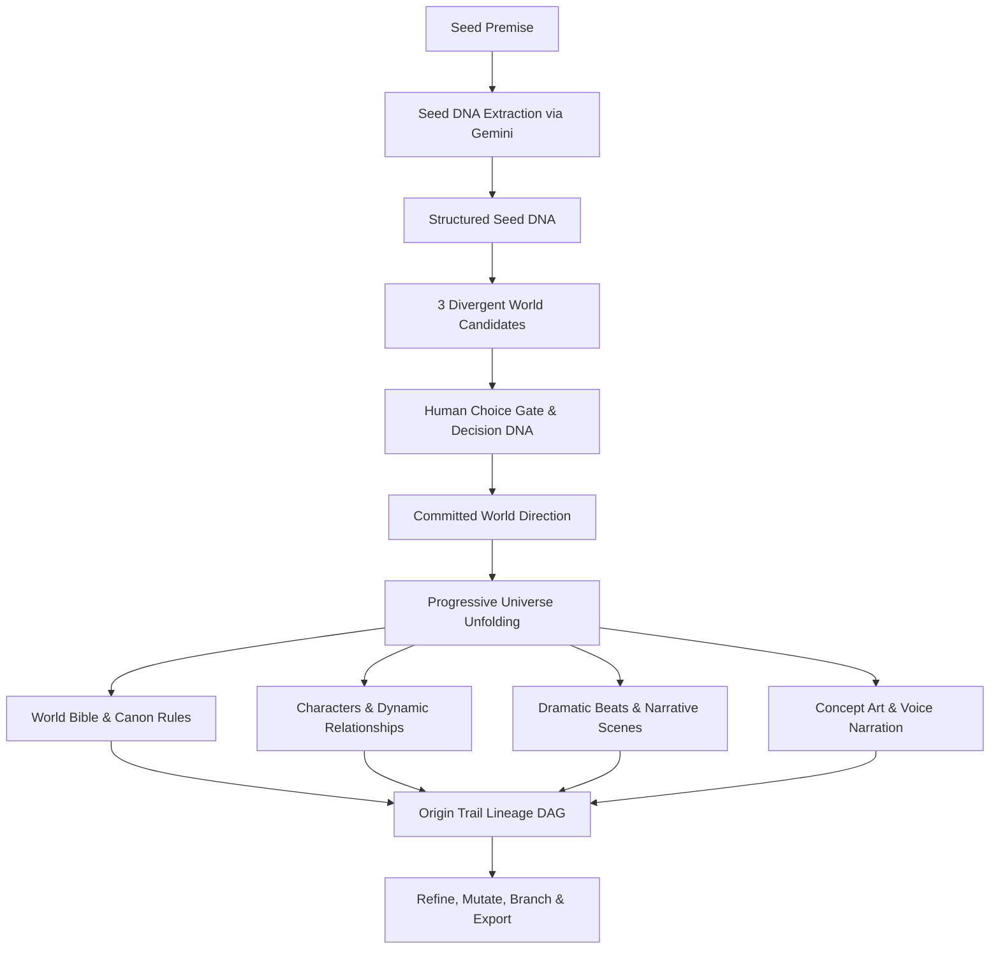

# PRAROHA — Product Documentation
### Seed → Universe (Tatva 2: Forms Hidden in Formless)

**Hackathon:** Vedanta Makeathon  
**Team:** Supreme  
**Project Status:** Completed Hackathon Product Specification

---

## 1. Overview

**PRAROHA** (*formerly Seed Unfold during early development*) is a human-guided Generative AI engine that takes one incomplete idea (a "seed"), understands its latent intent, generates **exactly three** distinct creative worlds along orthogonal axes, lets the human creator choose one direction, and progressively unfolds that selected direction into a coherent, persistent, and traceable fictional universe.

---

## 2. Philosophical Connection: Tatva 2

PRAROHA is founded on **Tatva 2 — Seed to Universe: Forms Hidden in Formless**.

> *“The seed is the idea. The universe is what it can become.”*

Just as a mighty tree exists in unmanifest potential inside a physical seed, a simple story prompt contains latent lore, character motivations, tensions, and visual imagery. PRAROHA reveals these hidden forms without creative drift or lore contradictions.

---

## 3. The Core Product Workflow

---

## 4. Product Stages

1. **Stage 1 (Seed):** Unmanifest creative input.
2. **Stage 2 (Understand):** Extraction of themes, motifs, constraints, and tone into Seed DNA.
3. **Stage 3 (3 Worlds):** Synthesis of three divergent candidate worlds.
4. **Stage 4 (Choose):** Creator commits to one archetype, recording Decision DNA.
5. **Stage 5 (Unfold):** 5-layer Universe Codex generation (Bible, Cast, Relations, Beats, Scenes, Concept Art, Neural Speech).
6. **Stage 6 (Trace):** Origin Trail DAG and Causal Provenance Inspector.
7. **Stage 7 (Refine):** Seed Mutation Lab, Counterfactual Replay, and `.seedunfold.json` bundle export.

---

## 5. Primary References & Concept Glossary
- [PROJECT_OVERVIEW.md](file:///home/syed-imadulla/Desktop/Praroha/docs/PROJECT_OVERVIEW.md) — Comprehensive narrative and user stories.
- [CONCEPTS.md](file:///home/syed-imadulla/Desktop/Praroha/docs/product/CONCEPTS.md) — Definitions of all core product entities.
- Original blueprints in [`startDocs/`](file:///home/syed-imadulla/Desktop/Praroha/startDocs).
