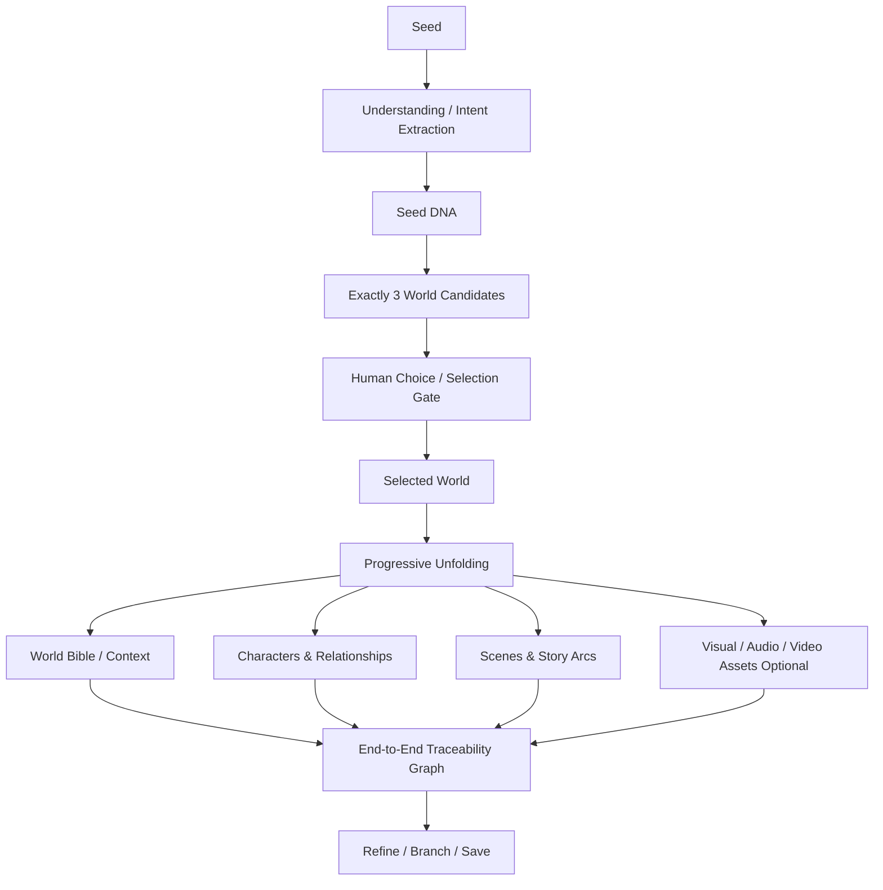

# Seed Unfold — Product Documentation

## Overview

**Seed Unfold** is a human-guided Generative AI engine that takes one incomplete idea (a "seed"), understands its latent intent, generates **exactly three** distinct creative/solution worlds, lets the human choose one direction, and progressively unfolds that selected direction into a coherent, persistent, and traceable mini-universe.

## The Core Product Loop

## Primary References
The original high-fidelity project specifications are preserved in [`startDocs/`](file:///home/syed-imadulla/Desktop/Praroha/startDocs):
- [`Seed_Unfold_Complete_Project_Documentation.pdf`](file:///home/syed-imadulla/Desktop/Praroha/startDocs/Seed_Unfold_Complete_Project_Documentation.pdf): Master hackathon product blueprint, market positioning, and full end-to-end workflow.
- [`Seed Unfold technical project documentation.pdf`](file:///home/syed-imadulla/Desktop/Praroha/startDocs/Seed%20Unfold%20technical%20project%20documentation.pdf): Deep technical reference for story-world development, schemas, and MVP stage architecture.
- [`SEED UNFOLD product documentation.pdf`](file:///home/syed-imadulla/Desktop/Praroha/startDocs/SEED%20UNFOLD%20product%20documentation.pdf): Product thesis, Tattva 2 philosophical connection, and UX wireframes.
- [`Seed Unfold Architecture and Workflow.png`](file:///home/syed-imadulla/Desktop/Praroha/startDocs/Seed%20Unfold%20Architecture%20and%20Workflow.png): Complete visual map of stages, actors, and data flow.

## Key Concept Definitions
See the companion document: [CONCEPTS.md](file:///home/syed-imadulla/Desktop/Praroha/docs/product/CONCEPTS.md) for detailed definitions of all 17 core product entities.
